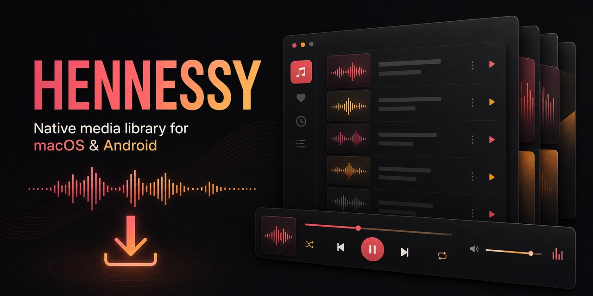

# Hennessy

<p align="center">
  
</p>

<p align="center">
  <a href="#quick-start"><strong>Quick Start</strong></a> ·
  <a href="https://github.com/Bananainkl/Project_Hennessy-open-source/releases">Releases</a> ·
  <a href="https://github.com/Bananainkl/Project_Hennessy-open-source/issues">Issues</a> ·
  <a href="https://github.com/Bananainkl/Project_Hennessy-open-source/discussions">Discussions</a>
</p>

<p align="center">
  
  
  
  
  
</p>

Hennessy is a native media downloader, local library, and player for macOS, with an experimental Android companion. It combines download planning, searchable local media, metadata, lyrics, playlists, and playback in one SwiftUI workspace.

## Why Hennessy

- **One native workflow** from a supported media URL to an organized local library.
- **Library-first design** with metadata editing, artwork, lyrics, duplicate detection, and resume state.
- **Transparent tooling**: large third-party executables stay out of source history and are documented explicitly.
- **Tested core policies** for playlist planning, duplicate matching, lyrics, artwork, and playback resume.

> Hennessy does not include downloaded media, `yt-dlp`, or FFmpeg binaries in this repository. You are responsible for using supported services and media in accordance with applicable terms and law.

## Features

- Search supported media sources and plan single-item or playlist downloads
- Download audio or video through user-installed or separately prepared `yt-dlp` and `ffmpeg` tools
- Maintain a local media library with artwork, lyrics, metadata editing, and duplicate detection
- Resume playback and manage playlists from a native SwiftUI interface
- Inspect download progress, history, and activity logs
- Audit local audio by codec and effective bitrate
- Safely re-download low-quality audio only when the candidate is measurably better, while retaining a recoverable backup
- Build an arm64 Android app for recent Samsung/Android devices

Downloaded files are saved to `~/Downloads/Media` by default. The packaged macOS app prefers tools placed under `Assets/Tools/` and falls back to common Homebrew locations during local development. The large third-party executables are not committed to Git.

The macOS app audits local audio automatically. Files below 120 kbps are marked as needing improvement, while MP3 files are identified as lossy compatibility conversions rather than higher-quality sources. In Settings, **Safe Re-download Low-Quality Files** checks the source again and replaces a file only when the candidate reaches at least 120 kbps and improves by at least 20% or 16 kbps. Original files are moved to a timestamped `Hennessy Quality Backups` folder beside the media library.

## Requirements

- macOS 14 or later
- Swift 6 toolchain / Xcode
- `yt-dlp` and `ffmpeg` for an unpackaged local development build

```bash
brew install yt-dlp ffmpeg
```

## Quick Start

```bash
git clone https://github.com/Bananainkl/Project_Hennessy-open-source.git
cd Project_Hennessy-open-source
brew install yt-dlp ffmpeg
swift test
./script/build_and_run.sh
```

## Build and Run

```bash
./script/build_and_run.sh
```

Useful verification commands:

```bash
swift test
./script/build_and_run.sh --verify
```

Create the local DMG with:

```bash
./script/package_dmg.sh
```

Generated app bundles, DMGs, APKs, local audit captures, and build caches are intentionally excluded from Git. Packaged releases should be distributed separately from source history.

Before packaging a self-contained build, prepare `Assets/Tools/ffmpeg` and `Assets/Tools/yt-dlp` as described in `Assets/Tools/README.md`. Review and satisfy the exact binary build's license and source-offer obligations before distributing it.

## Android

The Android project is under `android-app/`. See `android-app/README.md` for its build command, target device profile, and scoped-storage behavior.

## Project Layout

```text
Sources/Hennessy/
├── App/          # Application entry point
├── Models/       # Download, library, search, and lyrics models
├── Services/     # Downloader, player, metadata, artwork, and persistence
├── Stores/       # Observable application state
├── Support/      # Design system and platform helpers
└── Views/        # SwiftUI screens
Tests/HennessyTests/  # Unit and policy tests
android-app/          # Native Android companion app
script/               # Build, package, and asset scripts
```

## App Icon

Regenerate the macOS app icon with:

```bash
swift script/create_app_icon.swift
```

## Repository Notes

Hennessy is released under the [GNU General Public License v3.0 only](LICENSE). Third-party components retain their own licenses; see `Assets/Tools/THIRD_PARTY_NOTICES.txt` and the dependency metadata before distributing binaries.
